# Vaultwarden – How to Use (BSSE)

> **Ziel dieses Dokuments:** Dieses How-To beschreibt die Nutzung des von **BSSE.de** bereitgestellten Passwortdepots auf Basis von **Vaultwarden** (Bitwarden-kompatibel).  
> Es ist **kundenübergreifend generisch** gehalten und kann unverändert bei mehreren Mandanten eingesetzt werden.

---

## 1. Überblick

Mit Vaultwarden verwalten Sie Logins, Passwörter, Notizen und Dateien zentral in einem „Tresor“ (Vault).  
BSSE stellt die Plattform bereit; die **Nutzung im Alltag** (Einträge anlegen, Ordner/Organisationen, Freigaben, MFA etc.) ist in diesem Dokument beschrieben.

**Hinweis:** Menünamen können je nach App-Version (Web Vault / Desktop / Mobile / Browser-Erweiterung) leicht variieren.

---

## 2. Voraussetzungen

- Zugangsdaten (E-Mail/Benutzername) und URL zu Ihrem Vaultwarden (z. B. `https://vault.<kunde>.tld`)
- Für Browser-Autofill: installierte Browser-Erweiterung (Bitwarden Extension) – kompatibel mit Vaultwarden
- Für MFA: Authenticator-App (z. B. Microsoft Authenticator, Google Authenticator, FreeOTP)

---

## 3. Begriffe (kurz erklärt)

- **Eintrag (Item):** Gespeicherter Login (Benutzername, Passwort, URL, Notizen, ggf. MFA/OTP)
- **Ordner (Folder):** Private Strukturierung Ihrer persönlichen Einträge
- **Organisation:** Gemeinsamer Bereich für Teams/Abteilungen (Rollen & Rechte)
- **Sammlung (Collection):** Struktur innerhalb einer Organisation (ähnlich Ordner, aber für geteilte Inhalte)
- **Vault (Tresor):** Gesamter Datenbereich Ihres Kontos (persönlich + Organisationen)

---

## 4. Erste Schritte im Alltag

### 4.1 Neues Passwort / neuen Eintrag anlegen

1. Öffnen Sie Ihren Vault und wählen Sie **New** → **Item**.  
2. Tragen Sie **Name**, **Benutzername**, **URL** und **Passwort** ein.  
3. Optional: Passwort generieren (Generator-Symbol im Passwortfeld) und übernehmen.  
4. Optional: **OTP/MFA** hinterlegen (TOTP), wenn der Dienst ein Einmalpasswort benötigt.  
5. Mit **Save** speichern.

**Screenshots:**  
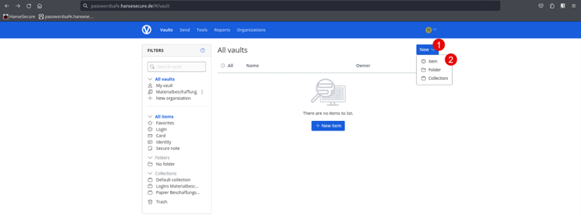  
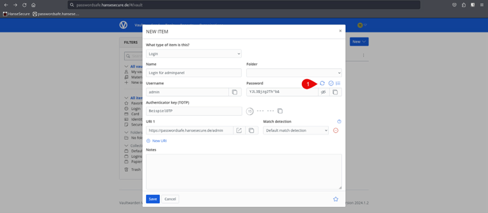  
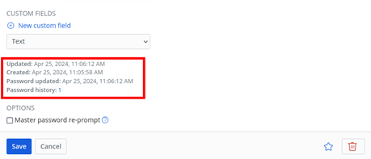  

---

### 4.2 „Falschen Eintrag geändert“ – Passwort-Historie nutzen

Wenn Sie ein Passwort geändert haben und merken, dass es der falsche Eintrag war, können Sie die **Passwort-Historie** verwenden:

1. Öffnen Sie den Eintrag.  
2. Scrollen Sie in den Bereich **Item information** / **Eintragsinformationen**.  
3. Öffnen Sie **Password history** und stellen Sie das vorige Passwort wieder her.

**Screenshots:**  
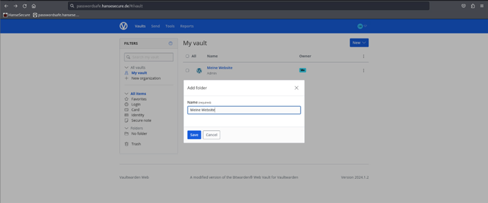  
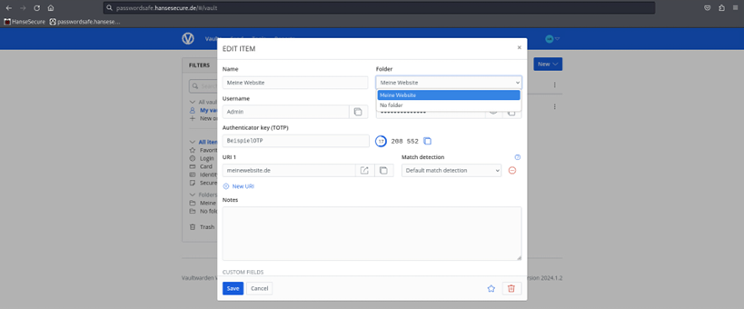

---

### 4.3 Ordner anlegen und Einträge zuordnen

Ordner helfen, private Einträge übersichtlich zu halten.

1. **New** → **Folder**  
2. Ordner benennen → **Save**  
3. Eintrag öffnen → Feld **Folder** → gewünschten Ordner auswählen → **Save**

**Screenshots:**  
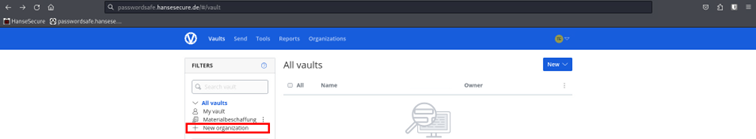  
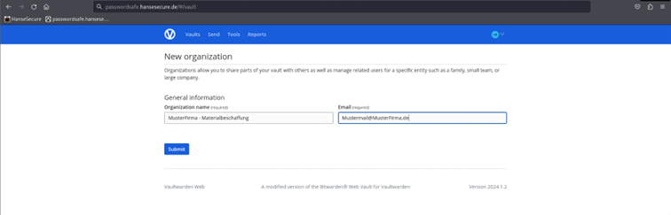  
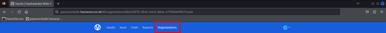

---

## 5. Zusammenarbeit im Team (Organisationen & Sammlungen)

### 5.1 Warum Organisationen?

Organisationen sind ideal, wenn mehrere Personen **gemeinsam** Zugangsdaten nutzen (z. B. Team-Account, Shared Mailbox, Lieferantenportal), ohne Passwörter per E-Mail/Teams oder in Excel zu verteilen.

---

### 5.2 Organisation anlegen

1. In der Übersicht rechts **New organization** auswählen  
2. Namen vergeben (z. B. „Abteilung Einkauf“ oder „IT“)  
3. E-Mail bestätigen → **Submit**

**Screenshots:**  
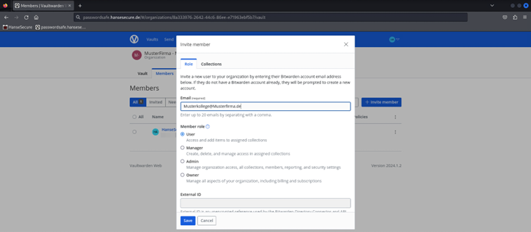  
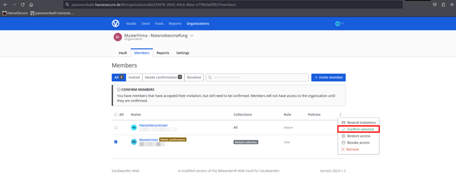

---

### 5.3 Mitglieder in eine Organisation einladen

1. Öffnen Sie **Organizations**  
2. Organisation auswählen → **Members**  
3. **Invite member**  
4. E-Mail-Adresse eintragen, Rolle wählen (z. B. User/Admin) → Einladung senden

**Screenshots:**  
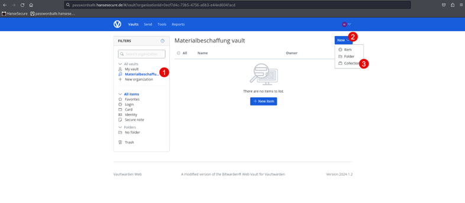  
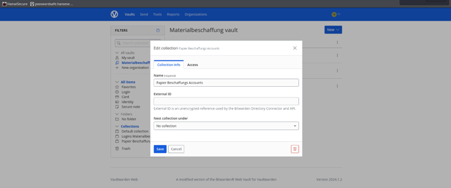  
  
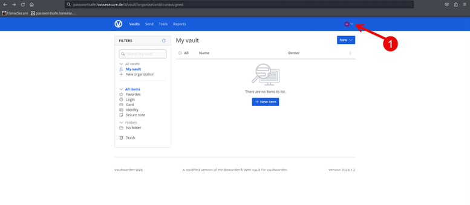

---

### 5.4 Sammlungen (Collections) innerhalb einer Organisation

Sammlungen strukturieren geteilte Inhalte in einer Organisation.

1. Organisation öffnen  
2. **New** → **Collection**  
3. Sammlung benennen (z. B. „Lieferantenportale“ / „Social Media“ / „Server-Logins“)  
4. Unter **Access** festlegen, wer Zugriff erhält  
5. Speichern

**Wichtig:** Je nach Rollenmodell können Sammlungen nur von Admins/Ownern erstellt werden.

**Screenshots:**  
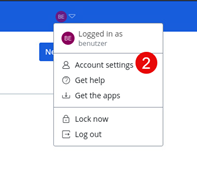  
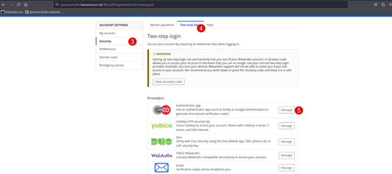  

---

## 6. Sicherheit: MFA verpflichtend und MFA aktivieren

### 6.1 MFA für eine Organisation verpflichtend machen (Policy)

Wenn Ihr Unternehmen MFA für alle Mitglieder einer Organisation vorschreiben möchte:

1. **Organizations** → Organisation auswählen  
2. **Settings** → **Policies**  
3. **Require two-step login** aktivieren  
4. **Save**

**Screenshots:**  
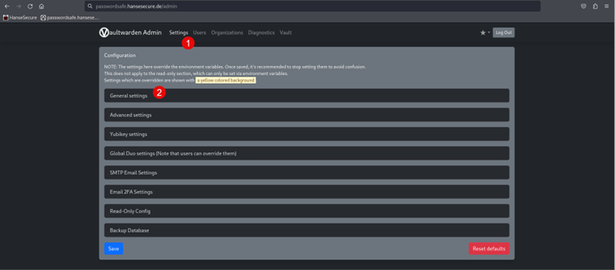  

---

### 6.2 MFA im Benutzerkonto aktivieren (Authenticator-App)

Wenn eine Organisation MFA voraussetzt, muss jeder Nutzer MFA in seinem Konto aktivieren.

1. Konto-Menü öffnen (Profil/Icon)  
2. **Account settings** / **Einstellungen**  
3. **Security** → **Two-step login**  
4. **Authenticator app** auswählen  
5. QR-Code mit Authenticator-App scannen und Code bestätigen

**Screenshots:**  
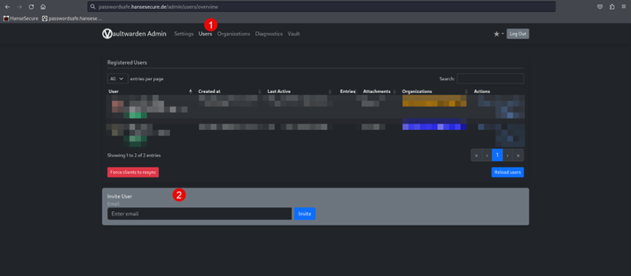  
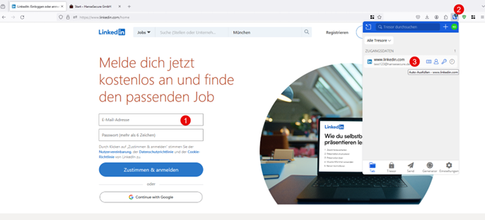  
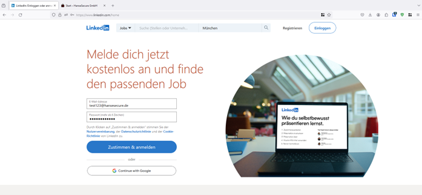  
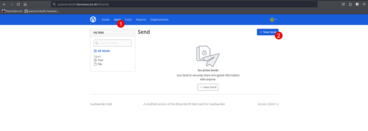

---

## 7. Registrierung: Nur eingeladene Nutzer (Best Practice für Unternehmen)

Damit sich nur autorisierte Personen registrieren können, kann die Selbstregistrierung deaktiviert werden.

### 7.1 „Allow new signups“ deaktivieren (Admin Panel)

1. Admin Panel öffnen  
2. **Settings** → **General settings**  
3. Häkchen bei **Allow new signups** entfernen  
4. Speichern

**Screenshots:**  
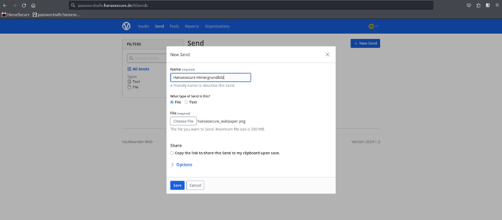

---

### 7.2 Nutzer einladen (wenn Signups deaktiviert sind)

1. Admin Panel → **Users**  
2. **Invite User**  
3. Einladung senden (der Nutzer registriert sich über den Einladungslink)

**Screenshots:**  
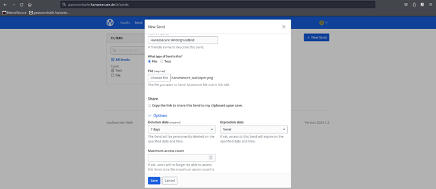

---

## 8. Komfortfunktionen

### 8.1 Automatisches Ausfüllen (Autofill) im Browser

Wenn Sie einen Login bereits als Eintrag gespeichert haben:

1. Website öffnen (Login-Feld fokussieren)  
2. Browser-Erweiterung öffnen  
3. Passenden Eintrag anklicken → Felder werden automatisch ausgefüllt

**Screenshot:**  
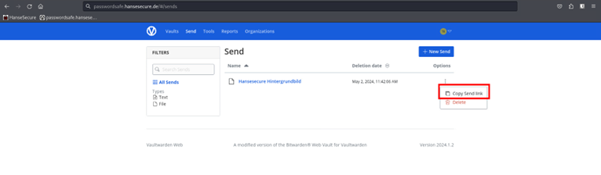

---

## 9. Support / Änderungen

Dieses Dokument ist für die Einbindung in ein Git-Repository gedacht (zentrale Pflege).  
Wenn Sie Unklarheiten haben oder Funktionen in Ihrer Instanz abweichen, wenden Sie sich an Ihren **BSSE Ansprechpartner**.

---

## 10. Ablage im Repository (Empfehlung)

- `HowToUse.md` (dieses Dokument)
- `HowToUse-images/` (Screenshots, referenziert über relative Pfade)

Beides kann gemeinsam in beliebigen Unterordnern liegen, solange die relative Referenz `./HowToUse-images/...` passt.
